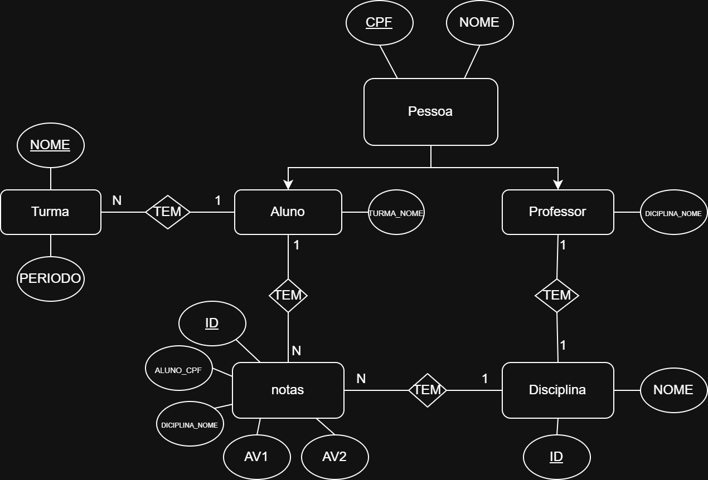

=======
## Sistema Administração Escolar

Um sistema básico de gerenciamento acadêmico para administrar alunos, professores, turmas, disciplinas e notas, utilizando Python, SQLAlchemy e um banco de dados SQLite.

## Modelo ER (Banco de dados)



## Descrição das Classes (Modelo Original)

O sistema utiliza as seguintes classes principais, mapeadas para o banco de dados:

* **`Pessoa (abstrata)`**:
    * Classe base para `Aluno` e `Professor`.
    * Contém atributos comuns como `cpf` e `nome`.
    * Define um método abstrato (por exemplo, `consultar_notas` como na sua classe `Pessoa` original, ou um mais genérico como `exibir_detalhes`).

* **`Aluno(Pessoa)`**:
    * Representa um aluno.
    * Pode ser associado a uma `Turma` e ter várias `Nota`s.
    * Métodos incluem: `criar_aluno`, `consultar_notas` (para ver suas disciplinas/notas), `adicionar_turma`, `listar_turma`.

* **`Professor(Pessoa)`**:
    * Representa um professor.
    * Pode estar associado a uma `Disciplina`.
    * Responsável por gerenciar `Nota`s (criar, consultar, modificar, excluir).

* **`Turma`**:
    * Representa uma turma acadêmica.
    * Atributos: `nome`, `periodo`.
    * Pode conter múltiplos `Aluno`s.
    * Métodos: `criar_turma`, `excluir_turma`, `listar_turmas`.

* **`Disciplina`**:
    * Representa uma disciplina.
    * Atributos: `id`, `nome`.
    * Pode ter `Nota`s associadas e `Professor`es.
    * Métodos: `criar_disciplina`, `listar_disciplina`, `excluir_disciplina`.

* **`Nota`**:
    * Representa as avaliações (AV1, AV2) de um `Aluno` em uma `Disciplina`.
    * Contém métodos para calcular `media` e determinar `situacao`.

## Como Executar

1.  **Pré-requisitos:**
    * Python 3.x
    * SQLAlchemy (`pip install sqlalchemy`)

2.  **Estrutura de Arquivos Esperada:**
    ```
    .
    ├── main.py
    ├── database.py
    ├── modelos/
    │   ├── __init__.py
    │   ├── aluno.py
    │   ├── disciplina.py
    │   ├── nota.py
    │   ├── pessoa.py
    │   ├── professor.py
    │   └── turma.py
    └── README.md (este arquivo)
    ```

3.  **Execução:**
    * Navegue até o diretório raiz do projeto.
    * Execute o comando: `python main.py`
    * O sistema iniciará, e o banco de dados `meu_banco.db` será criado automaticamente se não existir.

## Funcionalidades Principais (Menu Original)

O sistema oferece um menu de linha de comando para interagir com as seguintes funcionalidades:

* **Menu Principal:**
    * Criar Aluno
    * Criar Professor
    * Acessar submenus de Turma, Disciplina, Aluno e Professor.
* **Menu Aluno:**
    * Consultar disciplinas e notas do aluno.
    * Adicionar aluno a uma turma.
    * Listar as turmas em que um aluno está matriculado.
* **Menu Professor:**
    * Criar (lançar) notas para alunos.
    * Consultar notas (geralmente por disciplina ou aluno).
    * Modificar notas.
    * Excluir notas.
* **Menu Disciplina:**
    * Criar novas disciplinas.
    * Listar disciplinas existentes.
    * Excluir disciplinas.
* **Menu Turma:**
    * Criar novas turmas.
    * Excluir turmas.
    * Listar turmas existentes.

## Nome dos Integrantes

* Luis     RA 2402947
* Maycon   RA 2402929
* Ronaldo  RA 2403661
* Marcos   RA 2403120


---
>>>>>>> d28380d (Adiciona/atualiza README)
